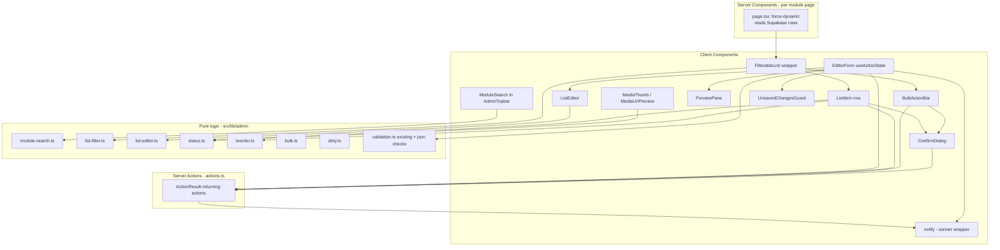

# Design Document

## Overview

This feature improves the usability of the existing Supabase-backed admin CMS at `src/app/admin/` without changing the data model, the public site, or the auth mechanism. It is an editor-experience layer that wraps the current server-component pages and server actions with richer, client-side interaction: a working module search, in-list search and status filters, delete confirmations, inline validation, descriptive notifications, quick status toggles, bulk actions, snappier reordering, structured list-field editing, content preview, an unsaved-changes guard, and media thumbnails.

### Current-state findings (verified in code)

The investigation of the live code confirmed the friction points and shaped the design:

- **`AdminTopbar.tsx`** renders a hardcoded `disabled` search input (`placeholder="Search modules..."`). Module labels already live in `src/lib/admin/nav-config.ts` (`ADMIN_NAV_GROUPS`), so module search needs no new data source.
- **List pages** (e.g. `projects/page.tsx`, `media/page.tsx`) are `export const dynamic = "force-dynamic"` Server Components that read all rows from Supabase and render `AdminListCard`s. Only **Guestbook** filters, and it does so server-side through a `?status=` URL param.
- **Server actions** in `src/app/admin/actions.ts` follow one shape: parse `FormData` with a Zod schema via `schema.parse(...)` (which **throws** on failure → Next.js error screen), mutate Supabase, call `revalidatePortfolio()` (which calls `updateTag("portfolio")`), then `redirect("…?saved=1")`.
- **Notifications** are driven by query params: `AdminToastListener.tsx` reads `?saved|deleted|moved=1` from `useSearchParams()` and fires a generic `sonner` toast; `AdminStatusBanner.tsx` renders a generic banner. Messages are not descriptive (no module/record identity).
- **Deletes** are plain `<form action={deleteX}>` submits with no confirmation.
- **Reordering** uses two `<form action={reorderX}>` submits (up/down) that swap `sort_order` of adjacent rows server-side and `redirect(...)`, causing a full navigation per step.
- **`SubmitButton.tsx`** already uses `useFormStatus()` (`react-dom`) for per-form pending state.
- **Array fields** (`stack`, `bullets`, `tags`, `marquee_items`, etc.) are edited as raw `<Textarea>` newline/JSON text and parsed by `parseJsonOrLines()` in `src/lib/admin/validation.ts`. `case_study`, `meta`, and `metadata` are raw JSON `<Textarea>`s.
- **Media** (`media/page.tsx`) only registers a `public_url` string with metadata — no thumbnail or preview.

### Schema impact assessment (additive column?)

Per the requirement to call out any additive column needed for `sort_order`/`status`:

- **`sort_order`** already exists on `projects`, `experiences`, `skill_groups`, `skills`, and `education`.
- **`status` (`draft`/`published`)** already exists on `projects`, `experiences`, `section_content`, `seo_settings`, `seo_pages`.
- **Education** has `sort_order` but **no** `status` column, and **Media** has neither `status` nor `sort_order`. Requirement 2.3 and Requirement 6.1 are both scoped *"WHERE a module's records have a Publication_Status"*, so the status filter and status toggle simply do not apply to Education or Media. Requirement 2.1 only asks for a **text** filter on Education and Media.

**Conclusion: no schema change is required.** All `sort_order`/`status` columns needed by the scoped requirements already exist. The design deliberately avoids migrations. (If a future iteration wanted publish/unpublish on Education, it would add a nullable `status text default 'published'` column, but that is out of scope here.)

### Verified Next.js / React conventions (Next 16.2.9, React 19.2.4)

Read from `node_modules/next/dist/docs` to comply with the workspace rule:

- **Server Actions** are async functions marked `"use server"` (file already uses the file-level directive). They are invoked from `<form action={...}>`, `<button formAction={...}>`, or directly from Client Components via `startTransition`. They are reachable by direct POST, so **every action must re-check auth** (the code already does this through `requireAdmin()`).
- **Validation errors & returned state**: the docs prescribe `useActionState(action, initialState)` (React 19) for forms that display field errors. The action signature becomes `(prevState, formData) => newState`. This is the mechanism we adopt to replace `schema.parse()`-throws with returned validation state — instead of throwing and showing the Next.js error screen.
- **Pending state**: `useActionState` returns a `pending` boolean; `useFormStatus()` (`react-dom`) also exposes `pending` for nested submit buttons (already used by `SubmitButton`).
- **Optimistic UI**: `useOptimistic` (React 19) for status toggle, reorder, and bulk actions.
- **Cache/revalidation**: this app runs with Cache Components — mutations call `updateTag("portfolio")` (read-your-own-writes) via the existing `revalidatePortfolio()`. To refresh a list in place after a client-invoked action (without a full navigation), the Client Component calls `router.refresh()` after the action resolves. `redirect()` from `next/navigation` is retained only where a true navigation is wanted (e.g. after creating a brand-new record).
- **Programmatic submit**: `form.requestSubmit()` is available for keyboard shortcuts if needed.

### Design goals

1. Keep Server Components as the data source of truth; layer interactivity in small, focused Client Components that receive server data + bound server actions as props.
2. Extract all decision logic (filtering, list-field editing, status inversion, reorder math, dirty detection, bulk aggregation, validation) into **pure, framework-free functions** in `src/lib/admin/` so they are unit- and property-testable in isolation.
3. Standardize server actions on a returned `ActionResult` discriminated union instead of throwing, so validation and server errors surface as friendly in-form messages and toasts.

## Architecture

### Layered structure



### Server action contract

All mutating actions converge on a single returned shape (no more throwing for expected failures):

```ts
// src/lib/admin/action-result.ts
export type FieldErrors = Record<string, string[]>;

export type ActionResult =
  | { ok: true; message: string; module: string; record?: string; data?: unknown }
  | { ok: false; kind: "validation"; fieldErrors: FieldErrors; values: Record<string, string> }
  | { ok: false; kind: "error"; message: string };
```

- **Validation failure** → `{ ok:false, kind:"validation", fieldErrors, values }`. `values` echoes the submitted fields so the form re-renders with the editor's input preserved exactly.
- **Server/DB failure** → `{ ok:false, kind:"error", message }` (no raw Supabase internals leaked; message is editor-friendly).
- **Success** → `{ ok:true, message, module, record }` where `message` names the action, module, and affected record (Requirement 5.1).

Actions use `schema.safeParse(...)` (replacing `schema.parse(...)`), wrap Supabase calls in try/catch, and return the union. They no longer `redirect(...?saved=1)` for in-place edits; navigation (e.g. new-record → list) is decided by the client based on `result.ok`. `updateTag("portfolio")` is still called on success.

> Auth note: every action keeps calling `requireAdmin()` first. `requireAdmin` failures remain genuine exceptions (not editor-correctable), so they may continue to throw, but are caught at the boundary and converted to a generic `{ ok:false, kind:"error" }` so editors never see a raw screen.

### Filtering & reorder state preservation (Requirement 8.7)

`FilterableList` is a Client Component that receives the full row array as props and holds the active `{ query, status }` filter in React state. Because it stays mounted across a `router.refresh()`, a reorder (which calls a server action then `router.refresh()`) updates the row props while preserving the filter state — satisfying 8.7 without putting filter state in the URL. Text filtering is debounced ~300ms (well within the 500ms budget of Requirement 2.2).

### Notification system

A thin wrapper `notify` over the already-installed `sonner`:

```ts
// src/lib/admin/notify.ts (client)
notify.success(message)  // auto-dismiss after 5s, has a close control
notify.error(message)    // distinct destructive style, persists until dismissed
notify.pending?(...)      // optional; controls show their own pending state instead
```

- Success toasts: `duration: 5000`, dismiss control enabled (Requirements 5.2, 5.3).
- Error toasts: `duration: Infinity`, destructive styling, dismiss control (Requirements 5.4).
- Messages are built from `ActionResult` (`message`, `module`, `record`).
- The legacy `?saved=1` query-param path and `AdminStatusBanner` are removed/retired; `AdminToastListener` is replaced by client components reading `ActionResult` directly.

## Components and Interfaces

### New / changed pure-logic modules (`src/lib/admin/`)

```ts
// module-search.ts
export type ModuleEntry = { href: string; label: string };
export function flattenModules(groups: AdminNavGroup[]): ModuleEntry[];
// Requirement 1: empty query → [], else case-insensitive substring on label.
export function searchModules(query: string, modules: ModuleEntry[]): ModuleEntry[];
export function clampQuery(input: string, max: number): string; // first `max` chars

// list-filter.ts
export type StatusFilter = "all" | "draft" | "published";
export type Filterable = { title: string; status?: string | null };
// Requirement 2: trim+case-insensitive title substring AND status equality (all = no status constraint).
export function filterItems<T extends Filterable>(
  items: T[],
  query: string,
  status: StatusFilter,
): T[];

// list-editor.ts  (Requirement 9)
export type AddResult =
  | { ok: true; entries: string[] }
  | { ok: false; reason: "empty" | "too-long" | "duplicate" | "max-entries" };
export function addEntry(entries: string[], raw: string): AddResult; // trim, validate, append
export function removeEntry(entries: string[], index: number): string[]; // preserves order
export function serializeEntries(entries: string[]): string; // JSON array, empties excluded
export const MAX_ENTRIES = 100;
export const MAX_ENTRY_LEN = 200;

// status.ts  (Requirements 6)
export type PubStatus = "draft" | "published";
export function toggleStatus(current: PubStatus): PubStatus; // published<->draft

// reorder.ts  (Requirement 8)
export type Orderable = { id: string };
// returns new array with item at index moved one step; out-of-range move returns input unchanged.
export function move<T extends Orderable>(items: T[], id: string, dir: "up" | "down"): T[];
export function canMove(index: number, length: number, dir: "up" | "down"): boolean;

// bulk.ts  (Requirement 7)
export type BulkOutcome = { succeeded: string[]; failed: string[] };
export function summarizeBulk(outcome: BulkOutcome): { succeeded: number; failed: number };

// dirty.ts  (Requirement 11)
export type FieldMap = Record<string, string>;
export function isDirty(baseline: FieldMap, current: FieldMap): boolean;

// json-field.ts  (Requirement 4.4, 4.5)
export type JsonCheck = { ok: true } | { ok: false; reason: "malformed" | "too-long" };
export const MAX_JSON_LEN = 100_000;
export function checkJsonField(raw: string): JsonCheck; // empty allowed; else length + JSON.parse

// media.ts  (Requirement 12)
export function isImageMime(mime: string | null | undefined): boolean;
```

### New / changed UI components (`src/components/admin/`)

| Component | Type | Responsibility | Requirements |
| --- | --- | --- | --- |
| `ModuleSearch` (replaces disabled input in `AdminTopbar`) | client | Enabled search box; debounced dropdown of matching module labels; keyboard select; empty-result message; 100-char cap; `router.push` on select | 1 |
| `FilterableList` | client | Wraps a module list; holds `{query,status}`; renders filtered `ListItem`s; "no match" message that retains inputs; owns bulk selection state | 2, 7, 8.7 |
| `ListFilterBar` | client | Text input + status select (status select only where module has status) | 2 |
| `ListItemRow` | client | Renders one record; hosts `StatusToggle`, `ReorderControls`, `DeleteButton`, `BulkCheckbox` | 3,6,7,8 |
| `StatusToggle` | client | Optimistic publish/unpublish; disabled while pending; revert + error toast on fail | 6 |
| `ReorderControls` | client | Up/down; disabled at boundaries; optimistic reorder + `router.refresh()`; toast | 8 |
| `BulkActionBar` | client | Shown when ≥1 selected; selected count; delete / publish / unpublish; bulk delete confirmation with exact count | 7 |
| `ConfirmDialog` / `DeleteButton` | client | Reusable confirm modal showing record name, confirm + cancel; invokes delete action; success/fail toast | 3 |
| `EditorForm` | client | `useActionState`-driven wrapper for create/edit forms; renders `FieldError`s; preserves values; pending state; success → toast (+ optional navigate); hosts `UnsavedChangesGuard` | 4,5,11 |
| `FieldError` | client | Renders field-level validation message adjacent to a field | 4 |
| `ListEditor` | client | Structured array-field editor (add/remove chips/rows); inline add errors; serializes to hidden input | 9 |
| `PreviewPane` | client | Live preview rendered from current form values; formats structured fields; graceful empty/invalid | 10 |
| `MediaThumb` | client | 150×150 thumbnail (image MIME) or type placeholder; placeholder on error/10s timeout | 12 |
| `MediaUrlPreview` | client | Debounced (500ms) live preview of typed URL; placeholder on error/timeout; none when empty | 12 |
| `UnsavedChangesGuard` | client | Tracks dirty state; intercepts in-app nav + `beforeunload`; confirm prompt; resets on save | 11 |

### `useActionState` form pattern

```tsx
"use client";
const initial: ActionResult | null = null;
const [state, formAction, pending] = useActionState(upsertProject, initial);

useEffect(() => {
  if (state?.ok) { notify.success(state.message); guard.markSaved(); /* maybe router.push */ }
  else if (state && state.kind === "error") notify.error(state.message);
}, [state]);

return (
  <form action={formAction}>
    <Input name="title" defaultValue={state?.ok === false && state.kind==="validation" ? state.values.title : initialValue} />
    {state?.ok === false && state.kind==="validation" && <FieldError errors={state.fieldErrors.title} />}
    <SubmitButton disabled={pending} pendingText="Saving…">Save</SubmitButton>
  </form>
);
```

### Module-by-module application

| Module | Filter (text/status) | Status toggle | Reorder | Bulk | List editor | Preview | Media |
| --- | --- | --- | --- | --- | --- | --- | --- |
| Projects | text + status | ✓ | ✓ | delete/publish/unpublish | stack,bullets,tags | ✓ | – |
| Experiences | text + status | ✓ | ✓ | delete/publish/unpublish | bullets | ✓ | – |
| Education | text only | – | ✓ | – | bullets | ✓ | – |
| Sections | – | ✓ | – | – | marquee/stats/nav | ✓ | – |
| Skills/Skill groups | – | – | ✓ (groups) | – | – | – | – |
| Guestbook | (existing status) | – (moderation) | – | delete | – | – | – |
| Media | text only | – | – | – | – | – | thumbnails + url preview |
| Profile/SEO/Loader | – | (seo status) | – | – | – | profile preview | – |

All destructive deletes across Projects, Experiences, Skills, Skill groups, Education, Sections, Media, SEO pages, and Guestbook route through `ConfirmDialog` (Requirement 3.5).

## Data Models

No database schema changes. The feature reuses existing tables and the types in `src/types/portfolio.ts` (`Project`, `Experience`, `Education`, `SectionContent`, `MediaAsset`, `GuestMessage`, `SeoSettings`, `SeoPage`, `SkillGroup`).

New **in-memory / transport** types only (no persistence):

```ts
// Filter UI state (client only)
type ListFilterState = { query: string; status: "all" | "draft" | "published" };

// Bulk selection state (client only)
type SelectionState = Set<string>; // selected record ids

// Server action result (transport)
type ActionResult = /* see action-result.ts above */;

// Bulk action request / response (transport)
type BulkRequest = { module: string; ids: string[]; op: "delete" | "publish" | "unpublish" };
type BulkResponse = { succeeded: string[]; failed: string[] };
```

Status semantics by module (existing columns):

- `projects.status`, `experiences.status`, `section_content.status`, `seo_pages.status`, `seo_settings.status`: `'draft' | 'published'` → eligible for status filter & toggle.
- `guestbook.status`: `'pending' | 'approved' | 'hidden'` → moderation, not Publication_Status; excluded from status toggle/filter; eligible for bulk **delete** only.
- `education`, `media_assets`: no status → text filter only.

`sort_order` reorder uses the existing adjacent-swap approach but is invoked client-side and the new ordering is computed by the pure `move()` function before being persisted; the server action persists the two swapped `sort_order` values (same as today) and returns an `ActionResult`.

## Correctness Properties

*A property is a characteristic or behavior that should hold true across all valid executions of a system — essentially, a formal statement about what the system should do. Properties serve as the bridge between human-readable specifications and machine-verifiable correctness guarantees.*

This feature is mostly UI on top of existing Server Components, so much of it is verified with example/component tests (see Testing Strategy). However, the decision logic has been deliberately extracted into pure functions in `src/lib/admin/`, and those functions carry clear universal properties. The properties below target that logic layer. They were derived from the prework analysis and consolidated to remove redundancy.

### Property 1: Module query is clamped to a 100-character prefix

*For any* input string `s`, `clampQuery(s, 100)` returns a string whose length is at most 100, equal to the first 100 characters of `s` when `s` is longer, and equal to `s` otherwise.

**Validates: Requirements 1.1, 1.6**

### Property 2: Module search returns exactly the case-insensitive substring matches

*For any* query string and any set of modules, `searchModules(query, modules)` returns exactly the modules whose label contains the query as a case-insensitive substring, and returns the empty list when the query is empty or whitespace-only.

**Validates: Requirements 1.2, 1.5**

### Property 3: In-list filter is the conjunction of title match and status, with empty/all as identity

*For any* list of items, any text query, and any status selection, `filterItems(items, query, status)` returns exactly the items whose title contains the trimmed query case-insensitively AND (the status is `all` OR the item's status equals the selected status); when the query is empty and the status is `all`, the result equals the original list in its original order.

**Validates: Requirements 2.2, 2.4, 2.6**

### Property 4: Status toggle inverts and is its own inverse

*For any* publication status `s` in {`draft`, `published`}, `toggleStatus(s)` returns the other value, and `toggleStatus(toggleStatus(s))` equals `s`.

**Validates: Requirements 6.2, 6.3**

### Property 5: Bulk selection toggle is a reversible membership flip

*For any* selection set and any record id, toggling the id once flips its membership in the set, and toggling it twice restores the original selection set.

**Validates: Requirements 7.1**

### Property 6: Bulk status application targets exactly the selected records

*For any* collection of records, any subset of selected ids, and any operation in {`publish`, `unpublish`}, applying the bulk status sets every selected record's status to the operation's target status (`published` for publish, `draft` for unpublish) and leaves every non-selected record unchanged.

**Validates: Requirements 7.5**

### Property 7: Bulk outcome partitions the requested ids

*For any* bulk request over a set of ids and any resulting `BulkOutcome`, the succeeded and failed id lists are disjoint, their union equals the requested ids, and the success count plus the failure count equals the total requested.

**Validates: Requirements 7.7**

### Property 8: Reorder moves one step and preserves the rest

*For any* list and any interior item, `move(items, id, dir)` shifts that item exactly one position in the requested direction, preserves the relative order of all other items, and returns a permutation containing exactly the same multiset of ids as the input (no item added or dropped).

**Validates: Requirements 8.1, 8.7**

### Property 9: Reorder boundaries are correctly detected

*For any* list, `canMove(0, length, "up")` is false, `canMove(length-1, length, "down")` is false, and `canMove(index, length, dir)` is true for every interior position in the corresponding direction.

**Validates: Requirements 8.2, 8.3**

### Property 10: Adding a valid entry appends its trimmed value

*For any* entry list with fewer than 100 items and any raw string that, after trimming, is non-empty, at most 200 characters, and not already present, `addEntry` returns success with the trimmed value appended as the last element and the length increased by exactly one.

**Validates: Requirements 9.2**

### Property 11: Rejected entries never mutate the list

*For any* entry list and any raw string that is empty/whitespace-only, or trims to more than 200 characters, or duplicates an existing entry, or would exceed 100 entries, `addEntry` returns a failure with the corresponding reason and leaves the entry list unchanged.

**Validates: Requirements 9.3, 9.4, 9.5, 9.1**

### Property 12: Removing an entry preserves the order of the remainder

*For any* entry list and any valid index, `removeEntry` returns a list with exactly that element removed, length decreased by one, and the relative order of all remaining entries preserved.

**Validates: Requirements 9.6**

### Property 13: List-field serialization round-trips

*For any* entry list, parsing the serialized form (`parseJsonOrLines(serializeEntries(entries))`) yields the same entries in the same order with empty/whitespace-only entries excluded.

**Validates: Requirements 9.7, 9.8**

### Property 14: JSON field validation classifies content correctly

*For any* string, `checkJsonField` returns ok when the string is empty or is valid JSON of at most 100,000 characters, returns `too-long` when its length exceeds 100,000, and returns `malformed` when it is a non-empty string within the length limit that `JSON.parse` rejects.

**Validates: Requirements 4.4, 4.5**

### Property 15: Validation failure preserves submitted values exactly

*For any* map of submitted form fields that fails schema validation, the returned `ActionResult` has `kind = "validation"`, names every rejected field in `fieldErrors`, and its `values` map reproduces each submitted field's string exactly as entered.

**Validates: Requirements 4.1, 4.2**

### Property 16: Dirty detection reflects any divergence from the baseline

*For any* baseline field map, `isDirty(baseline, baseline)` is false, and for any field map that differs from the baseline in at least one field value, `isDirty` is true.

**Validates: Requirements 11.1, 11.6**

### Property 17: Image MIME classification

*For any* MIME-type string, `isImageMime` returns true if and only if the string begins with `image/`.

**Validates: Requirements 12.2**

## Error Handling

The central change is moving from "throw raw `Error` → Next.js error screen" to "return a typed `ActionResult` → friendly in-form feedback."

### Validation errors (Requirements 4.1, 4.2, 4.4, 4.5)

- Server actions replace `schema.parse()` with `schema.safeParse()`. On failure they build `fieldErrors` from `error.flatten().fieldErrors` (each message names the field and reason) and return `{ ok:false, kind:"validation", fieldErrors, values }`.
- JSON-bearing fields (`case_study`, `meta`, `metadata`) are pre-checked with `checkJsonField` before parsing; `malformed` and `too-long` map to field errors and abort the save.
- `EditorForm` reads the returned state via `useActionState`, renders `FieldError` next to each field, and re-seeds inputs from `state.values`. No navigation occurs (the action returns instead of redirecting), so unrelated entered values are also preserved.

### Server / database errors (Requirements 3.6, 4.3, 5.4, 6.6, 8.6)

- Supabase calls are wrapped; on `error`, the action returns `{ ok:false, kind:"error", message }` with an editor-friendly message (no raw Postgres text).
- The client shows a persistent, destructively styled error toast and keeps the editor on the form with values intact.
- For optimistic operations (status toggle, reorder, bulk), failure triggers a rollback of the optimistic state (`useOptimistic`) so the UI restores the previous value, followed by the error toast.

### Auth / unexpected errors

- `requireAdmin()` still guards every action (defense against direct POST). If it fails, or an unexpected exception occurs, the action boundary catches it and returns a generic `{ ok:false, kind:"error" }` so editors never see a raw stack screen. Genuine "not logged in" still redirects to `/admin/login` via the layout.

### Media load failures (Requirements 12.3, 12.6)

- `MediaThumb`/`MediaUrlPreview` use an `onError` handler plus a 10-second timeout; on either, they swap to a placeholder and leave the underlying record untouched.

### Bulk partial failure (Requirement 7.7)

- The bulk server action attempts each id independently, collects `succeeded`/`failed`, applies the action only to those that succeed, and returns the partition. The client reports both counts in a single notification.

## Testing Strategy

### Tooling

No test runner is currently installed. The design adds **Vitest** (fast, native ESM/TS, works with the Next 16 toolchain), **@testing-library/react** + **jsdom** for component tests, and **fast-check** for property-based testing. Test scripts (`test`, `test --run`) are added to `package.json`. Property tests must run in single-execution mode in CI (`vitest --run`) — never watch mode.

### Dual approach

- **Property-based tests** (fast-check) cover the pure logic layer in `src/lib/admin/` — the 17 properties above. This is where input variation finds real bugs (filtering, list editing, reorder math, validation, dirty detection).
- **Example / component tests** (Testing Library) cover UI behavior that does not vary meaningfully with input: dialogs and confirmations (Req 3), notification styling/duration/dismiss (Req 5), optimistic update + rollback rendering (Req 6, 8), bulk bar visibility and counts (Req 7), preview rendering and graceful invalid handling (Req 10), unsaved-changes prompts and `beforeunload` (Req 11), and media thumbnail/placeholder rendering (Req 12).
- **Integration tests** (1–3 examples, mocked Supabase) cover that delete/reorder/bulk actions persist and that actions return the right `ActionResult` on a mocked DB error.

### Property test configuration

- Each property is implemented by a **single** fast-check property test running a **minimum of 100 iterations** (fast-check default ≥100; set `numRuns: 100`).
- Each property test is tagged with a comment referencing this design:
  `// Feature: cms-management-usability, Property {n}: {property text}`
- Generators are designed to exercise edge cases the requirements call out: empty/whitespace strings, mixed case, Unicode, entries at the 200-char boundary and lists at the 100-entry cap, JSON strings around the 100,000-char limit, duplicate entries, single-element and empty lists for reorder, and arbitrary status mixes.

### Example coverage map (non-property criteria)

| Requirement(s) | Test type | Focus |
| --- | --- | --- |
| 1.3, 1.4 | component | navigate on select; empty-result message |
| 2.1, 2.3, 2.5 | component | filter renders; default `all`; no-match message retains inputs |
| 3.1–3.6 | component + integration | confirm dialog content, confirm/cancel, success/failure notifications |
| 4.3, 4.6 | component + integration | DB-error path; happy-path save + success toast |
| 5.2–5.5 | component | toast duration, dismiss control, error style, pending/disabled control |
| 6.1,6.4,6.5,6.6 | component | toggle display, optimistic update, disabled-while-pending, rollback |
| 7.2,7.3,7.4,7.6,7.8 | component | bulk bar visibility, count, confirm count, cancel, success count |
| 8.4,8.5,8.6 | integration + component | persistence, notification duration, rollback |
| 10.1–10.4 | component | live preview, formatted structured fields, graceful invalid |
| 11.2–11.5,11.7 | component | nav guard prompt, discard/cancel, beforeunload, failed-save dirty |
| 12.1,12.3,12.4,12.5,12.6 | component | thumbnail, placeholder on error/timeout, debounced url preview |

### Out of scope for PBT

Notification timing, toast styling, route navigation, `beforeunload` registration, optimistic-render rollback, and media loading are environment/UI behaviors with no meaningful "for all inputs" statement — they are covered by example and component tests, not property tests.
