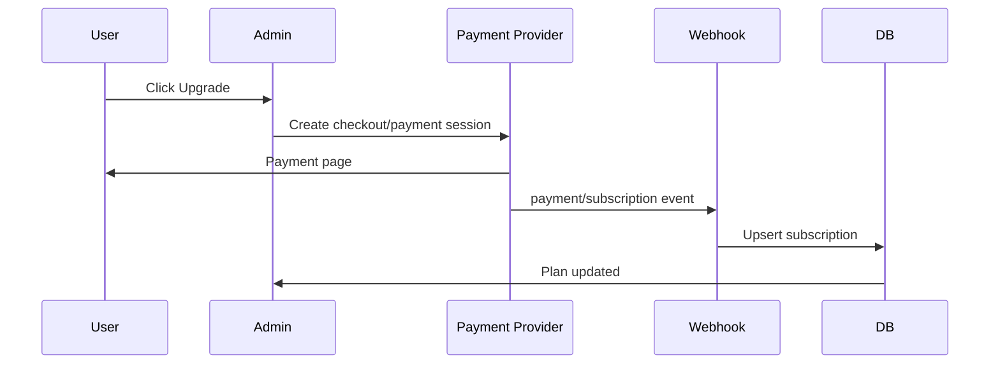

# 25. Billing & Plan Specification

> Draft v0.3 · Post-MVP core. Billing tidak wajib untuk private beta, tapi plan limit perlu disiapkan sejak awal.

## Prinsip

- Free tier harus bisa jalan tanpa payment provider.
- Semua limit wajib dicek server-side, bukan cuma hide button di UI.
- Payment provider masih bisa dipilih: **Stripe** untuk global, **Midtrans/Xendit** untuk Indonesia.
- Struktur DB dibuat provider-agnostic agar tidak terkunci ke satu vendor.

## Plans

| Feature | Free | Starter | Pro | Business |
|---|---:|---:|---:|---:|
| Sites | 1 | 1 | 3 | 10 |
| Subdomain | Yes | Yes | Yes | Yes |
| Custom domain | No | Optional add-on | Yes | Yes |
| Watermark | Yes | No | No | No |
| Templates | Limited | More | All | All |
| Analytics | Basic | Basic | Advanced | Advanced |
| Storage | 100 MB | 500 MB | 1 GB | 5 GB |
| Guestbook | Limited | Yes | Yes | Yes |
| Team members | No | No | 1–3 | 10 |
| Static/CDN | No | No | Yes | Yes |
| Support | Community | Community | Email | Priority |

## Pricing Draft Indonesia

| Plan | Monthly |
|---|---:|
| Free | Rp0 |
| Starter | Rp19k–29k |
| Pro | Rp49k–79k |
| Business | Rp149k+ |

## Provider Options

| Provider | Cocok untuk | Catatan |
|---|---|---|
| Stripe | Global SaaS | Subscription matang, tapi perlu kesiapan legal/account |
| Midtrans | Indonesia | Pembayaran lokal kuat, subscription perlu dicek ulang |
| Xendit | Indonesia/SEA | Payment link, VA, e-wallet, subscription support perlu validasi |

## Database

```sql
create table subscriptions (
  id uuid primary key default gen_random_uuid(),
  organization_id uuid not null references organizations(id) on delete cascade,
  plan text not null default 'free',
  status text not null default 'active',
  provider text,
  provider_customer_id text,
  provider_subscription_id text,
  current_period_end timestamptz,
  metadata jsonb not null default '{}',
  created_at timestamptz default now(),
  updated_at timestamptz default now()
);
```

## Limit Enforcement

| Limit | Check Point |
|---|---|
| Max sites | `createSiteAction` |
| Custom domain | `addDomainAction` |
| Premium template | `applyTemplateAction` |
| Storage quota | Upload action |
| Watermark | `SiteRenderer` |
| Advanced analytics | Analytics dashboard loader |
| Team member | Invite member action |

```ts
async function assertPlanFeature(orgId: string, feature: PlanFeature) {
  const subscription = await getOrganizationSubscription(orgId);

  if (!planIncludes(subscription.plan, feature)) {
    throw new PlanLimitError(feature);
  }

  return subscription;
}
```

## Billing Flow



## Webhook Requirements

- Verify webhook signature.
- Idempotent by provider event id.
- Never trust client callback only.
- Log failed webhook payload.
- Downgrade only after grace period.

## Grace Period

- Payment failed → 3-day grace.
- Show warning banner in admin.
- After grace → downgrade to Free.
- Custom domain disabled if plan no longer supports it.
- Public site should not disappear unless abuse/suspension.

## Acceptance

- [ ] Free user can use 1 site without payment setup.
- [ ] Plan checker blocks paid-only features.
- [ ] Payment webhook is idempotent.
- [ ] Failed payment enters grace period.
- [ ] Downgrade disables custom domain but keeps subdomain active.
- [ ] No client-side bypass for plan limits.

---

## Detail v0.3 — Billing Timing

Billing bukan blocker private beta.

Yang perlu dari awal:

- plan checker
- free limit
- watermark support
- subscription table provider-agnostic

Yang bisa nanti:

- payment provider
- webhook
- invoice
- custom domain paid enforcement

---

## Appendix v0.3 — Detail Implementasi Tambahan

### Tujuan Operasional

Dokumen ini tidak hanya menjadi catatan konsep, tapi juga menjadi pegangan saat implementasi. Setiap keputusan di dalam dokumen harus bisa diturunkan menjadi task engineering, skenario QA, dan acceptance criteria.

### Prinsip Umum

- Gunakan pendekatan incremental, bukan rewrite total.
- Semua fitur yang menyentuh data user wajib scoped by `site_id`.
- Semua akses admin wajib melewati auth dan ownership guard.
- Public site hanya membaca data published, bukan draft.
- Jika ada konflik antara kecepatan rilis dan keamanan tenant, keamanan tenant harus diprioritaskan.
- Setiap perubahan besar harus bisa dirollback.

### Checklist Review

- [ ] Scope dokumen sudah jelas.
- [ ] Out of scope sudah ditulis agar tidak melebar.
- [ ] Dependency dengan dokumen lain sudah jelas.
- [ ] Ada acceptance criteria.
- [ ] Ada risiko dan mitigasi.
- [ ] Ada checklist QA atau validasi.
- [ ] Naming konsisten: `platform.com`, `site_id`, `organization_id`, `site_publish_snapshots`.
- [ ] Tidak ada keputusan yang bertentangan dengan PRD.

### Definition of Done

Dokumen dianggap siap dipakai jika engineer bisa membaca dokumen ini dan tahu:

1. Apa yang harus dibuat.
2. File/area mana yang kemungkinan berubah.
3. Data apa yang dibutuhkan.
4. Risiko apa yang harus dijaga.
5. Bagaimana cara mengetes hasilnya.
