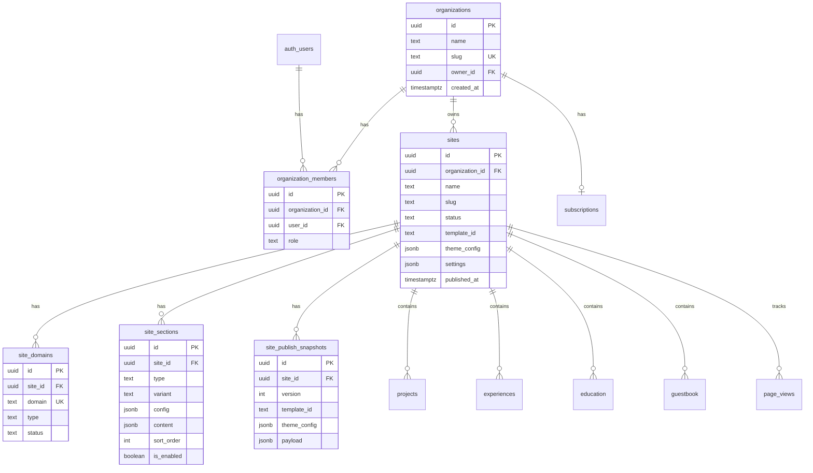

# 5. Database Design / ERD

## Entity Relationship (MVP)



## New Tables (SQL summary)

See R&D §8 for full DDL. Core tables:

- `organizations`, `organization_members`
- `sites`, `site_domains`, `site_sections`
- `site_publish_snapshots`, `subscriptions`
- `page_views` (analytics)

## Existing Tables — Add `site_id`

| Table | Notes |
|-------|-------|
| `projects` | NOT NULL after backfill |
| `experiences` | same |
| `education` | same |
| `skill_groups` / skills | same |
| `guestbook` | same |
| `seo_settings` | per site |
| `sections` (CMS) | migrate or merge into `site_sections` |

## Indexes (recommended)

```sql
create index idx_sites_org on sites(organization_id);
create index idx_sites_slug on sites(slug);
create index idx_site_domains_domain on site_domains(domain);
create index idx_projects_site on projects(site_id);
create index idx_snapshots_site_version on site_publish_snapshots(site_id, version desc);
create index idx_page_views_site_created on page_views(site_id, created_at desc);
```

## Snapshot Payload Shape

```json
{
  "version": 3,
  "templateId": "infinite-field-v1",
  "themeConfig": { "preset": "forest-hearth", "font": "syne" },
  "profile": { },
  "sections": [ { "type": "hero", "variant": "default", "content": {} } ],
  "projects": [ ],
  "experiences": [ ],
  "seo": { }
}
```

## Migration Order

1. Create new tables (no RLS yet on dev)
2. Add nullable `site_id` to content tables
3. Create default org + site; backfill
4. SET NOT NULL + FK constraints
5. Enable RLS + policies
6. Deploy app changes

Detail: [saas-migration-plan.md](./saas-migration-plan.md)

---

## Detail v0.3 — Database Rules

### Mandatory Indexes

```sql
create index sites_org_id_idx on sites(organization_id);
create unique index site_domains_domain_idx on site_domains(lower(domain));
create index site_sections_site_sort_idx on site_sections(site_id, sort_order);
create index site_publish_snapshots_site_version_idx on site_publish_snapshots(site_id, version desc);
create index page_views_site_created_idx on page_views(site_id, created_at desc);
```

### Migration Safety

- Tambah column `site_id` sebagai nullable dulu.
- Backfill.
- Update application query.
- Validate null count.
- Baru set `not null`.
- Baru enable RLS.

### Data Integrity

- Snapshot immutable.
- Domain unique.
- Section ordered per site.
- Content tenant-owned wajib punya `site_id`.

---

## Appendix v0.3 — Detail Implementasi Tambahan

### Tujuan Operasional

Dokumen ini tidak hanya menjadi catatan konsep, tapi juga menjadi pegangan saat implementasi. Setiap keputusan di dalam dokumen harus bisa diturunkan menjadi task engineering, skenario QA, dan acceptance criteria.

### Prinsip Umum

- Gunakan pendekatan incremental, bukan rewrite total.
- Semua fitur yang menyentuh data user wajib scoped by `site_id`.
- Semua akses admin wajib melewati auth dan ownership guard.
- Public site hanya membaca data published, bukan draft.
- Jika ada konflik antara kecepatan rilis dan keamanan tenant, keamanan tenant harus diprioritaskan.
- Setiap perubahan besar harus bisa dirollback.

### Checklist Review

- [ ] Scope dokumen sudah jelas.
- [ ] Out of scope sudah ditulis agar tidak melebar.
- [ ] Dependency dengan dokumen lain sudah jelas.
- [ ] Ada acceptance criteria.
- [ ] Ada risiko dan mitigasi.
- [ ] Ada checklist QA atau validasi.
- [ ] Naming konsisten: `platform.com`, `site_id`, `organization_id`, `site_publish_snapshots`.
- [ ] Tidak ada keputusan yang bertentangan dengan PRD.

### Definition of Done

Dokumen dianggap siap dipakai jika engineer bisa membaca dokumen ini dan tahu:

1. Apa yang harus dibuat.
2. File/area mana yang kemungkinan berubah.
3. Data apa yang dibutuhkan.
4. Risiko apa yang harus dijaga.
5. Bagaimana cara mengetes hasilnya.
