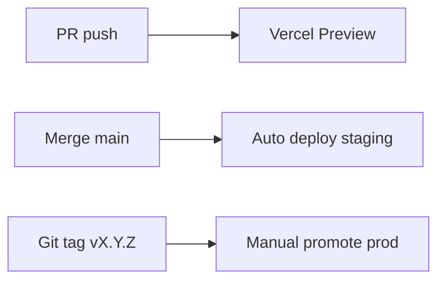

# 26. Deployment Plan

## Environments

| Env | Domain | Supabase | Branch |
|-----|--------|----------|--------|
| Local | localhost:3000 | Supabase local / dev project | any |
| Preview | `*.vercel.app` | dev project | PR branches |
| Staging | `staging.platform.com` | staging project | `main` |
| Production | `platform.com`, `*.platform.com` | prod project | tagged release |

## Hosting Stack

- **App:** Vercel (Next.js)
- **DB/Auth/Storage:** Supabase (managed)
- **DNS:** Cloudflare or Vercel DNS
- **Payments:** TBD — Stripe/Midtrans/Xendit
- **Email:** Resend or Supabase Auth emails

## Vercel Configuration

```json
// vercel.json (if needed)
{
  "regions": ["sin1", "iad1"],
  "headers": [/* security headers */]
}
```

### Wildcard Domain

1. Add `platform.com` to Vercel project
2. Add `*.platform.com` wildcard
3. DNS: `CNAME *.platform.com → cname.vercel-dns.com`

## Environment Variables

| Variable | Environments |
|----------|--------------|
| `NEXT_PUBLIC_SUPABASE_URL` | all |
| `NEXT_PUBLIC_SUPABASE_ANON_KEY` | all |
| `SUPABASE_SERVICE_ROLE_KEY` | server only, all |
| `APP_DOMAIN` | `platform.com` |
| `PAYMENT_SECRET_KEY` | staging, prod |
| `PAYMENT_WEBHOOK_SECRET` | staging, prod |
| `NEXT_PUBLIC_STRIPE_PUBLISHABLE_KEY` | staging, prod |

## Deploy Pipeline



## Database Migrations

1. Write migration in `supabase/migrations/`
2. Apply to staging: `supabase db push`
3. Run integration tests
4. Apply to prod during low-traffic window
5. Monitor errors 30 min

## Rollback

| Layer | Action |
|-------|--------|
| App | Vercel instant rollback to previous deployment |
| DB | Forward-only migrations; repair migration if needed |
| Feature flag | Disable SaaS features without redeploy |

## Pre-Deploy Checklist

- [ ] Migrations applied staging
- [ ] E2E pass on staging
- [ ] Env vars set in Vercel prod
- [ ] Payment webhook URL updated for prod
- [ ] DNS propagated for wildcard

## Post-Deploy Smoke

- [ ] Login works
- [ ] Publish works
- [ ] Random subdomain resolves
- [ ] Payment provider test mode off (prod only)

---

## Detail v0.3 — Deployment Safety

### Staging Must Mirror Production

- Separate Supabase project.
- Same migration flow.
- Same env var names.
- Same wildcard domain pattern if possible.

### Smoke Test After Deploy

- root loads
- login works
- dashboard loads
- subdomain resolves
- publish works
- public snapshot updates

---

## Appendix v0.3 — Detail Implementasi Tambahan

### Tujuan Operasional

Dokumen ini tidak hanya menjadi catatan konsep, tapi juga menjadi pegangan saat implementasi. Setiap keputusan di dalam dokumen harus bisa diturunkan menjadi task engineering, skenario QA, dan acceptance criteria.

### Prinsip Umum

- Gunakan pendekatan incremental, bukan rewrite total.
- Semua fitur yang menyentuh data user wajib scoped by `site_id`.
- Semua akses admin wajib melewati auth dan ownership guard.
- Public site hanya membaca data published, bukan draft.
- Jika ada konflik antara kecepatan rilis dan keamanan tenant, keamanan tenant harus diprioritaskan.
- Setiap perubahan besar harus bisa dirollback.

### Checklist Review

- [ ] Scope dokumen sudah jelas.
- [ ] Out of scope sudah ditulis agar tidak melebar.
- [ ] Dependency dengan dokumen lain sudah jelas.
- [ ] Ada acceptance criteria.
- [ ] Ada risiko dan mitigasi.
- [ ] Ada checklist QA atau validasi.
- [ ] Naming konsisten: `platform.com`, `site_id`, `organization_id`, `site_publish_snapshots`.
- [ ] Tidak ada keputusan yang bertentangan dengan PRD.

### Definition of Done

Dokumen dianggap siap dipakai jika engineer bisa membaca dokumen ini dan tahu:

1. Apa yang harus dibuat.
2. File/area mana yang kemungkinan berubah.
3. Data apa yang dibutuhkan.
4. Risiko apa yang harus dijaga.
5. Bagaimana cara mengetes hasilnya.
