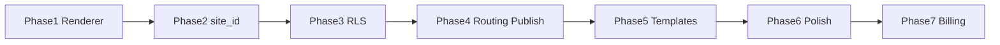

# 1. Roadmap

> Phase plan SaaS Portfolio Platform · v0.1 · 2026-06-27

## Prinsip

- Incremental refactor dari repo existing — **bukan rewrite**.
- Ship tenant isolation sebelum marketplace/billing kompleks.
- Renderer data-driven dulu, multi-tenant kedua.

## Phase Overview

| Phase | Nama | Durasi | Outcome |
|-------|------|--------|---------|
| 0 | Audit & safety | 2–3 hari | Backup, dependency map, risk list |
| 1 | Renderer refactor | 1–2 minggu | `SiteRenderer`, registries, 2–3 template POC |
| 2 | Site model + `site_id` | 1–2 minggu | `organizations`, `sites`, migration backfill |
| 3 | RLS + multi-user | 1–2 minggu | Tenant isolation, ownership tests |
| 4 | Routing + publish | 1–2 minggu | Subdomain, publish snapshot, preview |
| 5 | Template gallery | 2–3 minggu | Preset picker, section reorder, catalog UI |
| 6 | Polish | 1 minggu | SEO, analytics, QA, bugfix |
| 7 | Monetization | 2–4 minggu | Stripe, custom domain, plan limits |
| 8 | Scale | ongoing | Static/CDN, marketplace (optional) |

**MVP core:** Phase 0–6 · **8–12 minggu FT** / **12–16 minggu part-time**

## Milestones

```txt
M1  SiteRenderer live (single tenant, config-driven)
M2  site_id + backfill complete
M3  RLS audit pass (zero cross-tenant leak)
M4  First subdomain publish (username.app.com)
M5  Template gallery + 3 base templates
M6  Private beta (10–20 users)
M7  Public launch + Free tier
M8  Pro plan + custom domain
```

## Dependencies



## Out of scope (until post-MVP)

- Template marketplace upload
- Arbitrary user HTML/JS
- Full drag-and-drop builder
- DB-per-tenant
- E-commerce / blog CMS advanced

## Referensi

- Detail migration: [21-migration-plan.md](./21-migration-plan.md)
- Task breakdown: [20-implementation-tasks.md](./20-implementation-tasks.md)
