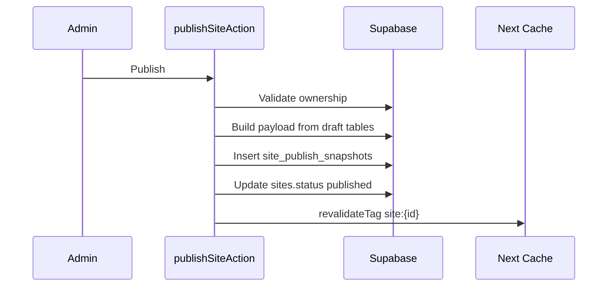
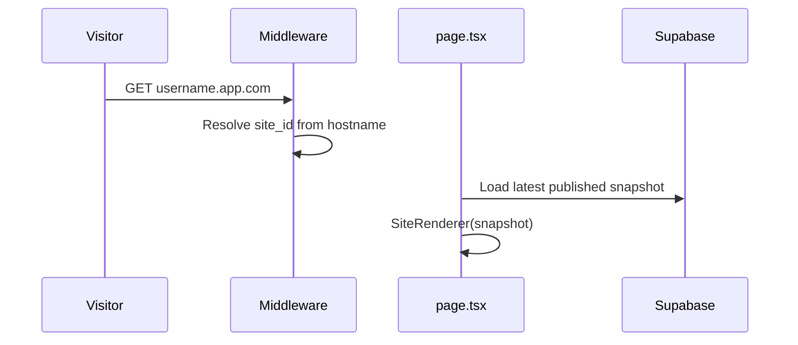

# 3. Technical Design Document (TDD)

> High-level technical design · v0.1

## Stack

| Layer | Choice | Rationale |
|-------|--------|-----------|
| Frontend | Next.js App Router | Existing repo, SSR/ISR |
| CMS UI | React + server actions | Existing admin |
| DB | Supabase Postgres | Existing, RLS native |
| Auth | Supabase Auth | Existing |
| Storage | Supabase Storage | Media uploads |
| Hosting | Vercel (MVP) | Fast deploy, middleware |
| Billing (later) | Stripe | Industry standard |

## Core Decisions

| Decision | Choice | Rejected |
|----------|--------|----------|
| Multi-tenant DB | Shared schema + `site_id` + RLS | DB-per-tenant, schema-per-tenant |
| Templates | Config-driven registry | User arbitrary code |
| Public data | Published snapshot JSON | Live draft table reads |
| Hosting MVP | Shared Next app | Static per site (deferred) |
| Public auth | Anonymous + RLS public policies | Service role on public pages |

## Module Boundaries

```txt
src/
├─ middleware.ts          → tenant resolve
├─ app/(public)/          → SiteRenderer entry
├─ app/admin/             → CMS (shared, site-scoped)
├─ app/api/track/         → analytics ingest
├─ app/api/publish/       → optional webhook/revalidate
├─ components/site-renderer/
├─ components/sections/   → registered section components
├─ lib/templates/         → templateRegistry
├─ lib/sections/          → sectionRegistry + schemas
├─ lib/site/              → resolve, snapshot, publish
└─ lib/portfolio.ts       → data access (site_id filtered)
```

## Data Flow — Publish



## Data Flow — Public Request



## Non-Functional Targets

| Metric | Target |
|--------|--------|
| Public LCP p75 | < 2.5s |
| Publish action | < 5s |
| Cross-tenant leak | 0 |
| Uptime | 99.5% MVP |

## Related Docs

- [04-system-architecture.md](./04-system-architecture.md)
- [10-renderer-refactor-plan.md](./10-renderer-refactor-plan.md)
