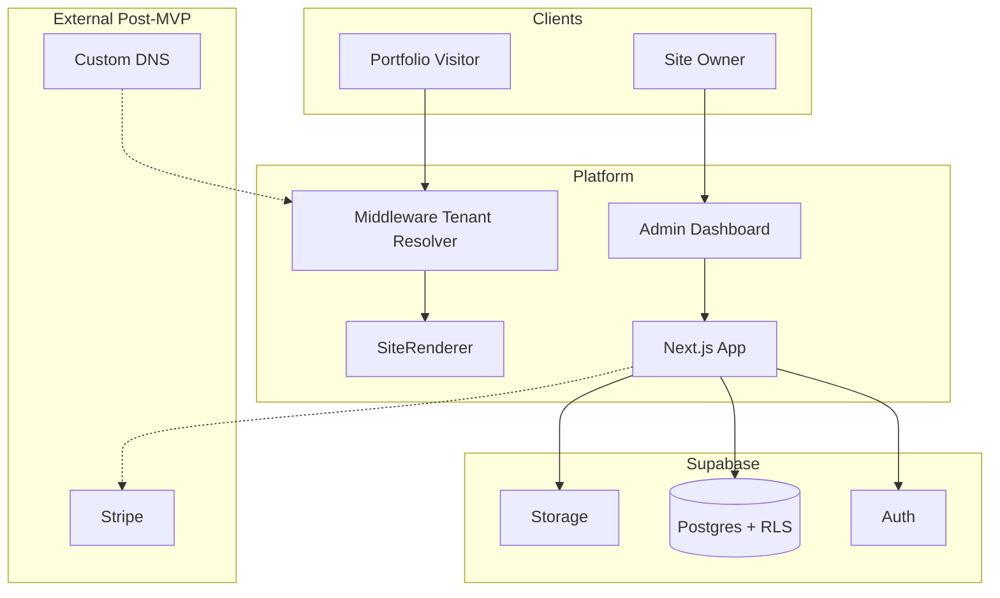

# 4. System Architecture Document

## Context Diagram



## Component Responsibilities

| Component | Responsibility |
|-----------|----------------|
| **Middleware** | Map hostname → `site_id`; attach headers/cookies for downstream |
| **SiteRenderer** | Pick template; render ordered sections |
| **SectionRenderer** | Map section type+variant → React component |
| **Admin Dashboard** | CRUD draft content; template/settings; publish |
| **Publish Service** | Serialize draft → snapshot; bump version |
| **Track API** | Ingest analytics with `site_id`, rate limit |
| **Supabase RLS** | Enforce tenant boundaries at DB |

## Deployment Topology (MVP)

```txt
                    ┌─────────────────┐
   *.app.com ──────►│ Vercel Edge     │
   app.com    ──────►│ Next.js (single)│
                    └────────┬────────┘
                             │
                    ┌────────▼────────┐
                    │ Supabase        │
                    │ - Postgres      │
                    │ - Auth          │
                    │ - Storage       │
                    └─────────────────┘
```

## Deployment Topology (Scale — Hybrid)

```txt
Free tier     → Shared Next app + ISR cache
Pro tier      → Shared app + aggressive CDN cache
Pro+ / static → Pre-rendered static to CDN per site (optional)
```

## Caching Strategy

| Layer | Key | TTL |
|-------|-----|-----|
| Next `unstable_cache` / tags | `site:{id}:published` | Until publish |
| CDN | HTML static assets | Standard |
| Snapshot read | Latest version per site | Immutable per version |

## Failure Modes

| Failure | Behavior |
|---------|----------|
| Unknown subdomain | 404 branded page |
| Site suspended | 403 + message |
| No published snapshot | "Coming soon" / onboarding CTA |
| DB down | 503 + retry |
