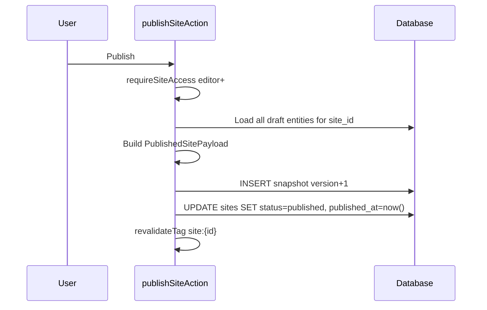

# 11. Publish & Snapshot Specification

## States

| Site status | Meaning |
|-------------|---------|
| `draft` | Editable; no public snapshot required |
| `published` | Latest snapshot served to public |
| `archived` | Hidden; retain data |
| `suspended` | Admin action; 403 public |

## Draft vs Published

- **Draft**: live rows in `projects`, `site_sections`, etc.
- **Published**: immutable row in `site_publish_snapshots.payload`

Public NEVER reads draft tables directly.

## Publish Flow



## Snapshot Schema

```ts
type PublishedSitePayload = {
  version: number;
  templateId: string;
  themeConfig: ThemeConfig;
  profile: Profile;
  sections: SiteSection[];
  projects: Project[];
  experiences: Experience[];
  education: Education[];
  skillGroups: SkillGroup[];
  guestbook: GuestMessage[]; // approved only
  seo: SeoSettings;
  publishedAt: string;
};
```

## Versioning

- Monotonic `version` per site (`unique(site_id, version)`)
- Keep last N snapshots (e.g. 20) — cron prune older
- **Rollback**: copy snapshot payload → draft OR set `sites.active_snapshot_version` (simpler: re-publish from old payload)

## Preview Mode

- Route: `/preview?token=...` or auth-only `/admin/preview`
- Renders draft data live (not snapshot)
- `robots: noindex`
- Watermark optional "Preview"

## Cache Invalidation

```ts
revalidateTag(`site:${siteId}:published`);
revalidatePath(`/`, 'layout'); // if single app
```

## Acceptance

- [ ] Edit project does not change public site until publish
- [ ] Publish completes < 5s for typical portfolio
- [ ] Rollback restores prior public version
- [ ] Preview never indexed
