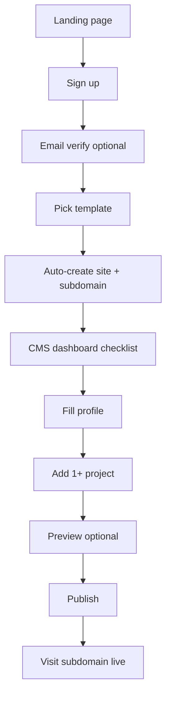
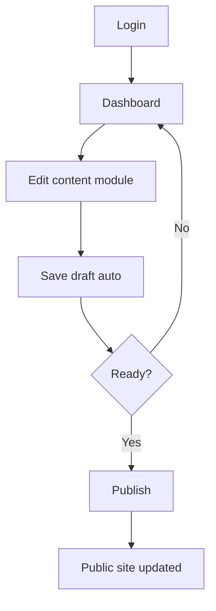
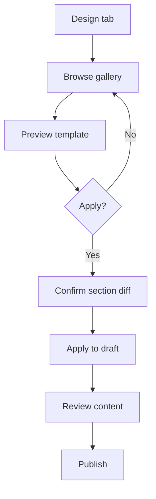
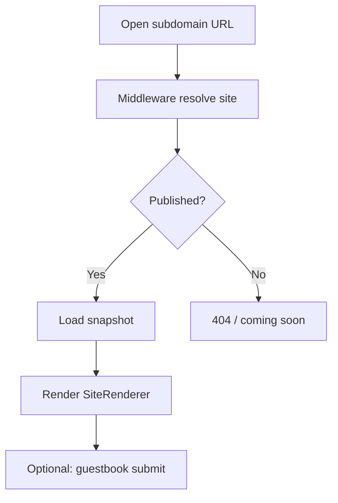
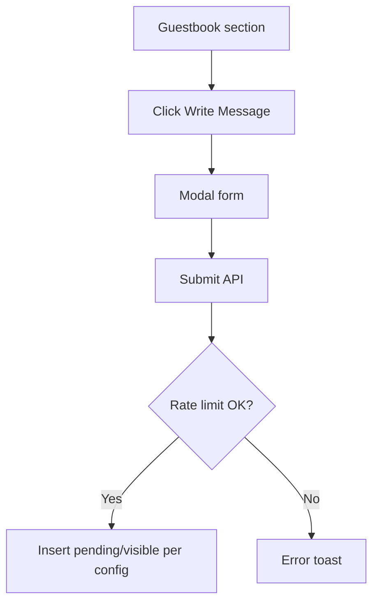
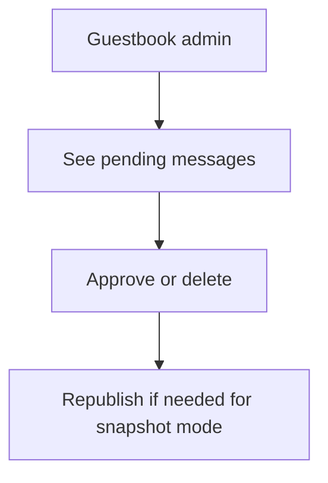

# 16. User Flow Document

## Flow 1 — Sign up & first publish (happy path)

**Goal:** < 30 minutes to live site.

## Flow 2 — Returning user edit

## Flow 3 — Template switch

## Flow 4 — Visitor

## Flow 5 — Guestbook submit (visitor)

## Flow 6 — Admin moderate guestbook

## Personas

See PRD §5 — primary: developer job seeker; secondary: freelancer/designer.

## Related

- [17-wireframe-screen-list.md](./17-wireframe-screen-list.md)
- [14-admin-dashboard-ia.md](./14-admin-dashboard-ia.md)
