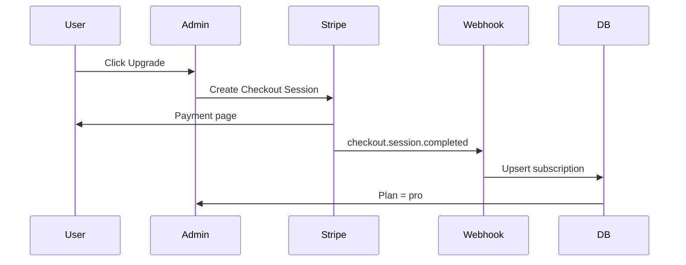

# 25. Billing & Plan Specification

## Plans (MVP Launch)

| Feature | Free | Pro |
|---------|------|-----|
| Sites | 1 | 3 |
| Templates | All MVP | All + future |
| Custom domain | ✗ | ✓ |
| Remove branding | ✗ | ✓ |
| Analytics | Basic | Full |
| Storage | 100 MB | 1 GB |
| Guestbook | ✓ | ✓ |
| Support | Community | Email |

Pricing TBD — suggest **$9–12/mo** Pro aligned with Carrd/Webflow entry.

## Stripe Integration

### Products

- `prod_free` — no Stripe sub (default)
- `prod_pro_monthly` — recurring price
- `prod_pro_yearly` — optional discount

### Flow



### Webhook Events

| Event | Action |
|-------|--------|
| `checkout.session.completed` | Create subscription row |
| `customer.subscription.updated` | Sync status, period end |
| `customer.subscription.deleted` | Downgrade to free |
| `invoice.payment_failed` | Mark past_due; grace 3 days |

## Database

```sql
CREATE TABLE subscriptions (
  id uuid PRIMARY KEY,
  organization_id uuid REFERENCES organizations(id),
  stripe_customer_id text,
  stripe_subscription_id text,
  plan text NOT NULL DEFAULT 'free',
  status text NOT NULL DEFAULT 'active',
  current_period_end timestamptz,
  created_at timestamptz DEFAULT now()
);
```

## Limit Enforcement

| Limit | Check Point |
|-------|-------------|
| Max sites | `createSiteAction` |
| Custom domain | `addDomainAction` — plan gate |
| Storage | Upload action — sum file sizes |
| Branding watermark | `SiteRenderer` — `plan === 'free'` |

```typescript
function assertPlanFeature(orgId: string, feature: PlanFeature) {
  const sub = await getSubscription(orgId);
  if (!planIncludes(sub.plan, feature)) {
    throw new PlanLimitError(feature);
  }
}
```

## Grace Period

- Payment failed → 3-day grace, banner in admin
- After grace → downgrade to free, disable custom domain routing

## Refunds

- Manual via Stripe dashboard MVP
- Self-serve cancel → access until period end

## Tax

- Stripe Tax (post-MVP) or manual geo restriction

## Acceptance

- [ ] Checkout completes and plan updates
- [ ] Webhook idempotent
- [ ] Free user blocked from custom domain
- [ ] Cancel retains Pro until period end
