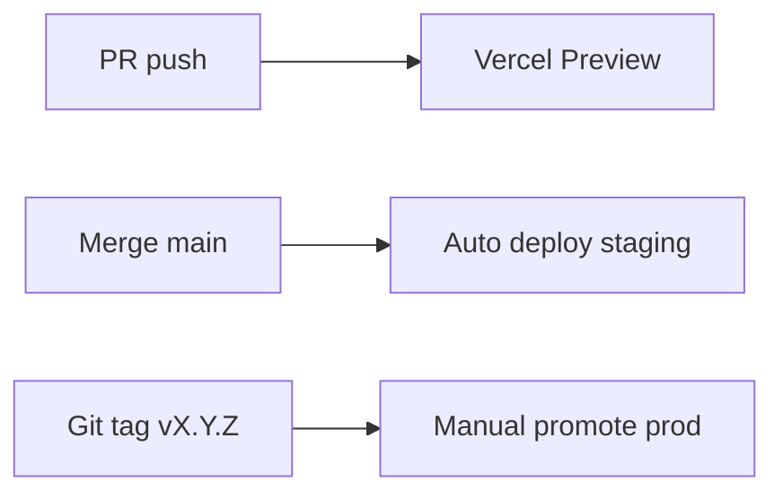

# 26. Deployment Plan

## Environments

| Env | Domain | Supabase | Branch |
|-----|--------|----------|--------|
| Local | localhost:3000 | Supabase local / dev project | any |
| Preview | `*.vercel.app` | dev project | PR branches |
| Staging | `staging.app.com` | staging project | `main` |
| Production | `app.com`, `*.app.com` | prod project | tagged release |

## Hosting Stack

- **App:** Vercel (Next.js)
- **DB/Auth/Storage:** Supabase (managed)
- **DNS:** Cloudflare or Vercel DNS
- **Payments:** Stripe
- **Email:** Resend or Supabase Auth emails

## Vercel Configuration

```json
// vercel.json (if needed)
{
  "regions": ["sin1", "iad1"],
  "headers": [/* security headers */]
}
```

### Wildcard Domain

1. Add `app.com` to Vercel project
2. Add `*.app.com` wildcard
3. DNS: `CNAME *.app.com → cname.vercel-dns.com`

## Environment Variables

| Variable | Environments |
|----------|--------------|
| `NEXT_PUBLIC_SUPABASE_URL` | all |
| `NEXT_PUBLIC_SUPABASE_ANON_KEY` | all |
| `SUPABASE_SERVICE_ROLE_KEY` | server only, all |
| `APP_DOMAIN` | `app.com` |
| `STRIPE_SECRET_KEY` | staging, prod |
| `STRIPE_WEBHOOK_SECRET` | staging, prod |
| `NEXT_PUBLIC_STRIPE_PUBLISHABLE_KEY` | staging, prod |

## Deploy Pipeline



## Database Migrations

1. Write migration in `supabase/migrations/`
2. Apply to staging: `supabase db push`
3. Run integration tests
4. Apply to prod during low-traffic window
5. Monitor errors 30 min

## Rollback

| Layer | Action |
|-------|--------|
| App | Vercel instant rollback to previous deployment |
| DB | Forward-only migrations; repair migration if needed |
| Feature flag | Disable SaaS features without redeploy |

## Pre-Deploy Checklist

- [ ] Migrations applied staging
- [ ] E2E pass on staging
- [ ] Env vars set in Vercel prod
- [ ] Stripe webhook URL updated for prod
- [ ] DNS propagated for wildcard

## Post-Deploy Smoke

- [ ] Login works
- [ ] Publish works
- [ ] Random subdomain resolves
- [ ] Stripe test mode off (prod only)
