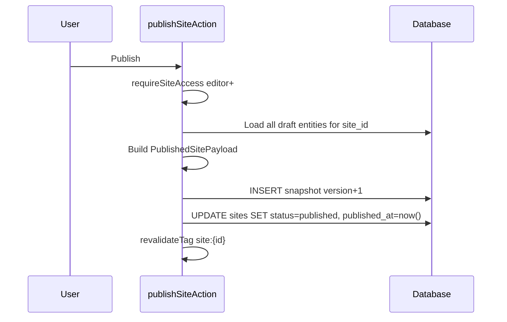

# 11. Publish & Snapshot Specification

## States

| Site status | Meaning |
|-------------|---------|
| `draft` | Editable; no public snapshot required |
| `published` | Latest snapshot served to public |
| `archived` | Hidden; retain data |
| `suspended` | Admin action; 403 public |

## Draft vs Published

- **Draft**: live rows in `projects`, `site_sections`, etc.
- **Published**: immutable row in `site_publish_snapshots.payload`

Public NEVER reads draft tables directly.

## Publish Flow



## Snapshot Schema

```ts
type PublishedSitePayload = {
  version: number;
  templateId: string;
  themeConfig: ThemeConfig;
  profile: Profile;
  sections: SiteSection[];
  projects: Project[];
  experiences: Experience[];
  education: Education[];
  skillGroups: SkillGroup[];
  guestbook: GuestMessage[]; // approved only
  seo: SeoSettings;
  publishedAt: string;
};
```

## Versioning

- Monotonic `version` per site (`unique(site_id, version)`)
- Keep last N snapshots (e.g. 20) — cron prune older
- **Rollback**: copy snapshot payload → draft OR set `sites.active_snapshot_version` (simpler: re-publish from old payload)

## Preview Mode

- Route: `/preview?token=...` or auth-only `/admin/preview`
- Renders draft data live (not snapshot)
- `robots: noindex`
- Watermark optional "Preview"

## Cache Invalidation

```ts
revalidateTag(`site:${siteId}:published`);
revalidatePath(`/`, 'layout'); // if single app
```

## Acceptance

- [ ] Edit project does not change public site until publish
- [ ] Publish completes < 5s for typical portfolio
- [ ] Rollback restores prior public version
- [ ] Preview never indexed

---

## Detail v0.3 — Snapshot Rules

### Snapshot Immutable

Snapshot yang sudah dibuat tidak boleh diedit. Rollback harus membuat snapshot version baru dari payload lama.

### Publish Validation

Publish harus validasi:

- site exists
- user can publish
- template exists
- theme valid
- section list valid
- SEO title exists/generated
- no invalid URL

### Failure Rule

Jika publish gagal, public site tetap pakai snapshot lama.

---

## Appendix v0.3 — Detail Implementasi Tambahan

### Tujuan Operasional

Dokumen ini tidak hanya menjadi catatan konsep, tapi juga menjadi pegangan saat implementasi. Setiap keputusan di dalam dokumen harus bisa diturunkan menjadi task engineering, skenario QA, dan acceptance criteria.

### Prinsip Umum

- Gunakan pendekatan incremental, bukan rewrite total.
- Semua fitur yang menyentuh data user wajib scoped by `site_id`.
- Semua akses admin wajib melewati auth dan ownership guard.
- Public site hanya membaca data published, bukan draft.
- Jika ada konflik antara kecepatan rilis dan keamanan tenant, keamanan tenant harus diprioritaskan.
- Setiap perubahan besar harus bisa dirollback.

### Checklist Review

- [ ] Scope dokumen sudah jelas.
- [ ] Out of scope sudah ditulis agar tidak melebar.
- [ ] Dependency dengan dokumen lain sudah jelas.
- [ ] Ada acceptance criteria.
- [ ] Ada risiko dan mitigasi.
- [ ] Ada checklist QA atau validasi.
- [ ] Naming konsisten: `platform.com`, `site_id`, `organization_id`, `site_publish_snapshots`.
- [ ] Tidak ada keputusan yang bertentangan dengan PRD.

### Definition of Done

Dokumen dianggap siap dipakai jika engineer bisa membaca dokumen ini dan tahu:

1. Apa yang harus dibuat.
2. File/area mana yang kemungkinan berubah.
3. Data apa yang dibutuhkan.
4. Risiko apa yang harus dijaga.
5. Bagaimana cara mengetes hasilnya.
