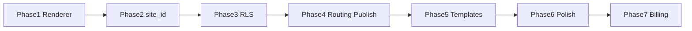

# 1. Roadmap

> Phase plan SaaS Portfolio Platform · v0.2 · 2026-06-27

## Prinsip

- Incremental refactor dari repo existing — **bukan rewrite**.
- Ship tenant isolation sebelum marketplace/billing kompleks.
- Renderer data-driven dulu, multi-tenant kedua.

## Phase Overview

| Phase | Nama | Durasi | Outcome |
|-------|------|--------|---------|
| 0 | Audit & safety | 2–3 hari | Backup, dependency map, risk list |
| 1 | Renderer refactor | 1–2 minggu | `SiteRenderer`, registries, 2–3 template POC |
| 2 | Site model + `site_id` | 1–2 minggu | `organizations`, `sites`, migration backfill |
| 3 | RLS + multi-user | 1–2 minggu | Tenant isolation, ownership tests |
| 4 | Routing + publish | 1–2 minggu | Subdomain, publish snapshot, preview |
| 5 | Template gallery | 2–3 minggu | Preset picker, section reorder, catalog UI |
| 6 | Polish | 1 minggu | SEO, analytics, QA, bugfix |
| 7 | Monetization | 2–4 minggu | Payment provider, custom domain, plan limits |
| 8 | Scale | ongoing | Static/CDN, marketplace (optional) |

**MVP core:** Phase 0–6 · **8–12 minggu FT** / **12–16 minggu part-time**

## Milestones

```txt
M1  SiteRenderer live (single tenant, config-driven)
M2  site_id + backfill complete
M3  RLS audit pass (zero cross-tenant leak)
M4  First subdomain publish (username.platform.com)
M5  Template gallery + 3 base templates
M6  Private beta (10–20 users)
M7  Public launch + Free tier
M8  Pro plan + custom domain
```

## Dependencies



## Out of scope (until post-MVP)

- Template marketplace upload
- Arbitrary user HTML/JS
- Full drag-and-drop builder
- DB-per-tenant
- E-commerce / blog CMS advanced

## Referensi

- Detail migration: [saas-migration-plan.md](./saas-migration-plan.md)
- Task breakdown: [saas-implementation-tasks.md](./saas-implementation-tasks.md)

---

## Detail v0.3 — Roadmap Gate

### Phase Gate Rules

Jangan lanjut ke fase berikutnya sebelum gate ini aman:

| Gate | Wajib Lulus |
|---|---|
| Renderer Gate | `SiteRenderer` render existing portfolio tanpa major regression |
| Data Gate | Semua content query sudah pakai `site_id` |
| RLS Gate | User A tidak bisa akses User B |
| Publish Gate | Draft tidak muncul di public sebelum publish |
| Routing Gate | Subdomain resolve site yang benar |
| Launch Gate | P0 QA pass dan tidak ada data leak |

### Urutan Paling Aman

```txt
Renderer → Template Registry → Site Model → site_id → RLS → Snapshot → Routing → CMS UX → SEO/Analytics → Billing
```

### Anti-Scope-Creep

Fitur berikut jangan masuk sebelum MVP stabil:

- Drag-and-drop builder penuh.
- Marketplace template.
- Custom code.
- Billing kompleks.
- Static export.
- Team management advanced.

---

## Appendix v0.3 — Detail Implementasi Tambahan

### Tujuan Operasional

Dokumen ini tidak hanya menjadi catatan konsep, tapi juga menjadi pegangan saat implementasi. Setiap keputusan di dalam dokumen harus bisa diturunkan menjadi task engineering, skenario QA, dan acceptance criteria.

### Prinsip Umum

- Gunakan pendekatan incremental, bukan rewrite total.
- Semua fitur yang menyentuh data user wajib scoped by `site_id`.
- Semua akses admin wajib melewati auth dan ownership guard.
- Public site hanya membaca data published, bukan draft.
- Jika ada konflik antara kecepatan rilis dan keamanan tenant, keamanan tenant harus diprioritaskan.
- Setiap perubahan besar harus bisa dirollback.

### Checklist Review

- [ ] Scope dokumen sudah jelas.
- [ ] Out of scope sudah ditulis agar tidak melebar.
- [ ] Dependency dengan dokumen lain sudah jelas.
- [ ] Ada acceptance criteria.
- [ ] Ada risiko dan mitigasi.
- [ ] Ada checklist QA atau validasi.
- [ ] Naming konsisten: `platform.com`, `site_id`, `organization_id`, `site_publish_snapshots`.
- [ ] Tidak ada keputusan yang bertentangan dengan PRD.

### Definition of Done

Dokumen dianggap siap dipakai jika engineer bisa membaca dokumen ini dan tahu:

1. Apa yang harus dibuat.
2. File/area mana yang kemungkinan berubah.
3. Data apa yang dibutuhkan.
4. Risiko apa yang harus dijaga.
5. Bagaimana cara mengetes hasilnya.
