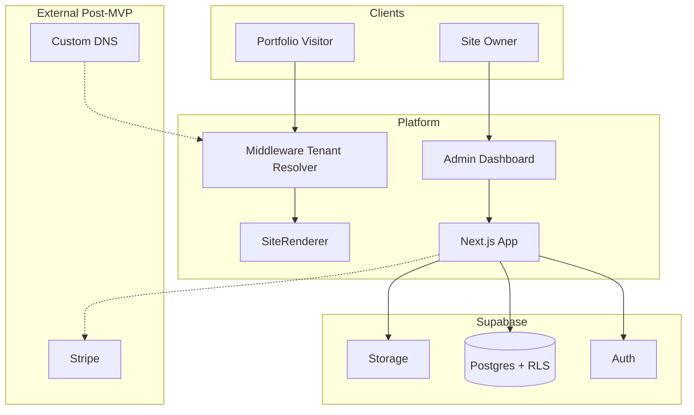

# 4. System Architecture Document

## Context Diagram



## Component Responsibilities

| Component | Responsibility |
|-----------|----------------|
| **Middleware** | Map hostname → `site_id`; attach headers/cookies for downstream |
| **SiteRenderer** | Pick template; render ordered sections |
| **SectionRenderer** | Map section type+variant → React component |
| **Admin Dashboard** | CRUD draft content; template/settings; publish |
| **Publish Service** | Serialize draft → snapshot; bump version |
| **Track API** | Ingest analytics with `site_id`, rate limit |
| **Supabase RLS** | Enforce tenant boundaries at DB |

## Deployment Topology (MVP)

```txt
                    ┌─────────────────┐
   *.platform.com ──────►│ Vercel Edge     │
   platform.com    ──────►│ Next.js (single)│
                    └────────┬────────┘
                             │
                    ┌────────▼────────┐
                    │ Supabase        │
                    │ - Postgres      │
                    │ - Auth          │
                    │ - Storage       │
                    └─────────────────┘
```

## Deployment Topology (Scale — Hybrid)

```txt
Free tier     → Shared Next app + ISR cache
Pro tier      → Shared app + aggressive CDN cache
Pro+ / static → Pre-rendered static to CDN per site (optional)
```

## Caching Strategy

| Layer | Key | TTL |
|-------|-----|-----|
| Next `unstable_cache` / tags | `site:{id}:published` | Until publish |
| CDN | HTML static assets | Standard |
| Snapshot read | Latest version per site | Immutable per version |

## Failure Modes

| Failure | Behavior |
|---------|----------|
| Unknown subdomain | 404 branded page |
| Site suspended | 403 + message |
| No published snapshot | "Coming soon" / onboarding CTA |
| DB down | 503 + retry |

---

## Detail v0.3 — Architecture Boundaries

### Boundary 1 — Public Runtime

Public runtime hanya boleh membaca:

- domain resolver result
- site status
- latest published snapshot
- public SEO config dari snapshot

### Boundary 2 — Admin Runtime

Admin runtime boleh membaca draft data setelah:

- user authenticated
- user adalah member organization
- user punya access ke site

### Boundary 3 — Publish Pipeline

Publish pipeline adalah jembatan draft ke public. Ini satu-satunya proses yang mengubah draft menjadi public snapshot.

### Boundary 4 — Analytics

Analytics harus async dan tidak boleh membuat public render gagal.

---

## Appendix v0.3 — Detail Implementasi Tambahan

### Tujuan Operasional

Dokumen ini tidak hanya menjadi catatan konsep, tapi juga menjadi pegangan saat implementasi. Setiap keputusan di dalam dokumen harus bisa diturunkan menjadi task engineering, skenario QA, dan acceptance criteria.

### Prinsip Umum

- Gunakan pendekatan incremental, bukan rewrite total.
- Semua fitur yang menyentuh data user wajib scoped by `site_id`.
- Semua akses admin wajib melewati auth dan ownership guard.
- Public site hanya membaca data published, bukan draft.
- Jika ada konflik antara kecepatan rilis dan keamanan tenant, keamanan tenant harus diprioritaskan.
- Setiap perubahan besar harus bisa dirollback.

### Checklist Review

- [ ] Scope dokumen sudah jelas.
- [ ] Out of scope sudah ditulis agar tidak melebar.
- [ ] Dependency dengan dokumen lain sudah jelas.
- [ ] Ada acceptance criteria.
- [ ] Ada risiko dan mitigasi.
- [ ] Ada checklist QA atau validasi.
- [ ] Naming konsisten: `platform.com`, `site_id`, `organization_id`, `site_publish_snapshots`.
- [ ] Tidak ada keputusan yang bertentangan dengan PRD.

### Definition of Done

Dokumen dianggap siap dipakai jika engineer bisa membaca dokumen ini dan tahu:

1. Apa yang harus dibuat.
2. File/area mana yang kemungkinan berubah.
3. Data apa yang dibutuhkan.
4. Risiko apa yang harus dijaga.
5. Bagaimana cara mengetes hasilnya.
