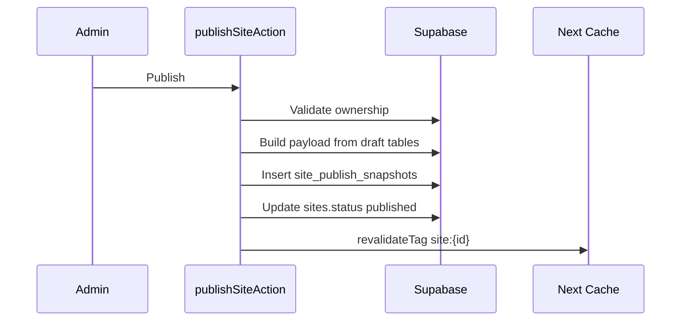
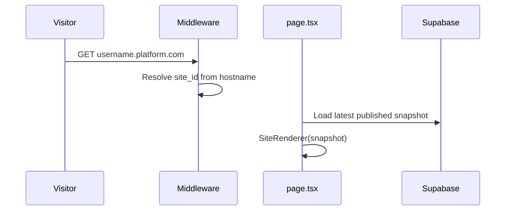

# 3. Technical Design Document (TDD)

> High-level technical design · v0.2

## Stack

| Layer | Choice | Rationale |
|-------|--------|-----------|
| Frontend | Next.js App Router | Existing repo, SSR/ISR |
| CMS UI | React + server actions | Existing admin |
| DB | Supabase Postgres | Existing, RLS native |
| Auth | Supabase Auth | Existing |
| Storage | Supabase Storage | Media uploads |
| Hosting | Vercel (MVP) | Fast deploy, middleware |
| Billing (later) | Provider TBD | Stripe/Midtrans/Xendit candidate |

## Core Decisions

| Decision | Choice | Rejected |
|----------|--------|----------|
| Multi-tenant DB | Shared schema + `site_id` + RLS | DB-per-tenant, schema-per-tenant |
| Templates | Config-driven registry | User arbitrary code |
| Public data | Published snapshot JSON | Live draft table reads |
| Hosting MVP | Shared Next app | Static per site (deferred) |
| Public auth | Anonymous + RLS public policies | Service role on public pages |

## Module Boundaries

```txt
src/
├─ middleware.ts          → tenant resolve
├─ app/(public)/          → SiteRenderer entry
├─ app/admin/             → CMS (shared, site-scoped)
├─ app/api/track/         → analytics ingest
├─ app/api/publish/       → optional webhook/revalidate
├─ components/site-renderer/
├─ components/sections/   → registered section components
├─ lib/templates/         → templateRegistry
├─ lib/sections/          → sectionRegistry + schemas
├─ lib/site/              → resolve, snapshot, publish
└─ lib/portfolio.ts       → data access (site_id filtered)
```

## Data Flow — Publish



## Data Flow — Public Request



## Non-Functional Targets

| Metric | Target |
|--------|--------|
| Public LCP p75 | < 2.5s |
| Publish action | < 5s |
| Cross-tenant leak | 0 |
| Uptime | 99.5% MVP |

## Related Docs

- [saas-system-architecture.md](./saas-system-architecture.md)
- [saas-renderer-refactor-plan.md](./saas-renderer-refactor-plan.md)

---

## Detail v0.3 — Technical Blueprint

### Core Runtime Flow

```txt
Request hostname
→ middleware normalize host
→ resolve domain
→ load site
→ load latest published snapshot
→ validate site status
→ render SiteRenderer
→ async track analytics
```

### Core Admin Flow

```txt
User login
→ dashboard resolve organization
→ select site
→ mutate draft data
→ preview draft
→ publish snapshot
```

### Error State Standard

| Error | UI |
|---|---|
| Unknown domain | 404 |
| Draft site | Not published |
| Suspended site | Suspended notice |
| Missing snapshot | Not published |
| Invalid template | Safe fallback |
| Unknown section | Skip section |

### Technical Non-Negotiable

- Service role tidak boleh masuk client bundle.
- Public renderer tidak boleh query draft table.
- Semua mutation wajib pakai server-side validation.

---

## Appendix v0.3 — Detail Implementasi Tambahan

### Tujuan Operasional

Dokumen ini tidak hanya menjadi catatan konsep, tapi juga menjadi pegangan saat implementasi. Setiap keputusan di dalam dokumen harus bisa diturunkan menjadi task engineering, skenario QA, dan acceptance criteria.

### Prinsip Umum

- Gunakan pendekatan incremental, bukan rewrite total.
- Semua fitur yang menyentuh data user wajib scoped by `site_id`.
- Semua akses admin wajib melewati auth dan ownership guard.
- Public site hanya membaca data published, bukan draft.
- Jika ada konflik antara kecepatan rilis dan keamanan tenant, keamanan tenant harus diprioritaskan.
- Setiap perubahan besar harus bisa dirollback.

### Checklist Review

- [ ] Scope dokumen sudah jelas.
- [ ] Out of scope sudah ditulis agar tidak melebar.
- [ ] Dependency dengan dokumen lain sudah jelas.
- [ ] Ada acceptance criteria.
- [ ] Ada risiko dan mitigasi.
- [ ] Ada checklist QA atau validasi.
- [ ] Naming konsisten: `platform.com`, `site_id`, `organization_id`, `site_publish_snapshots`.
- [ ] Tidak ada keputusan yang bertentangan dengan PRD.

### Definition of Done

Dokumen dianggap siap dipakai jika engineer bisa membaca dokumen ini dan tahu:

1. Apa yang harus dibuat.
2. File/area mana yang kemungkinan berubah.
3. Data apa yang dibutuhkan.
4. Risiko apa yang harus dijaga.
5. Bagaimana cara mengetes hasilnya.
