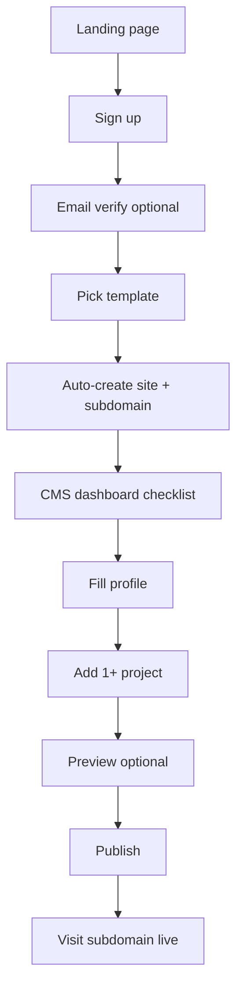
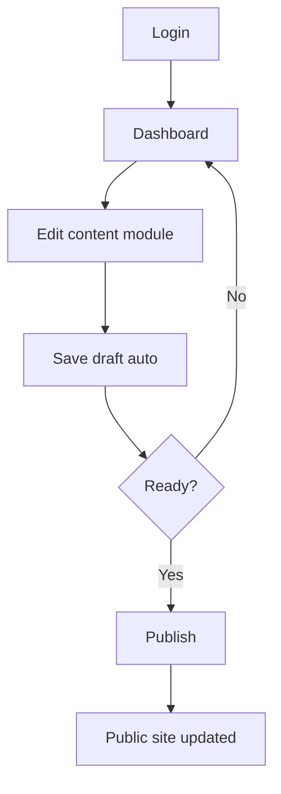
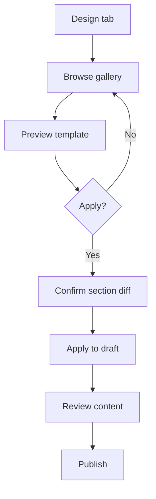
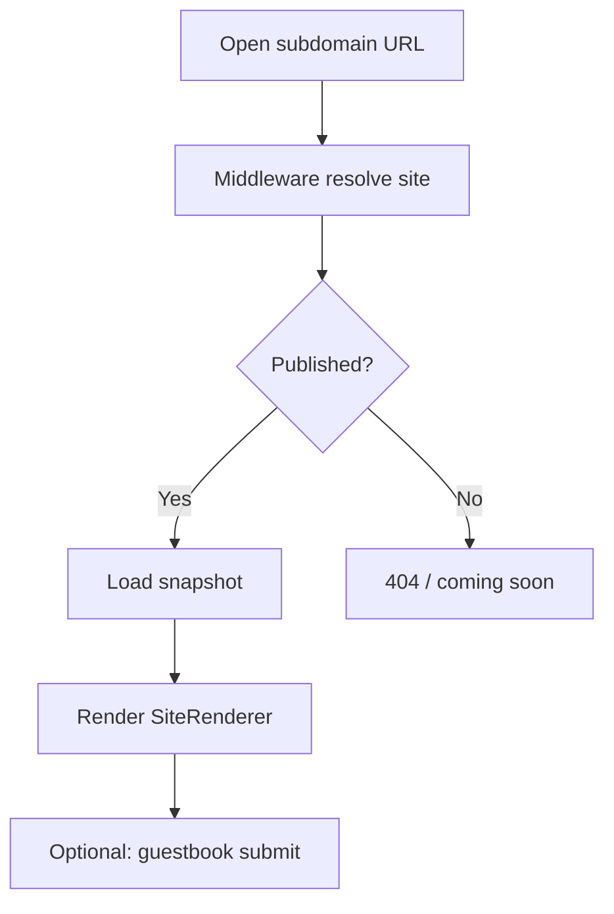
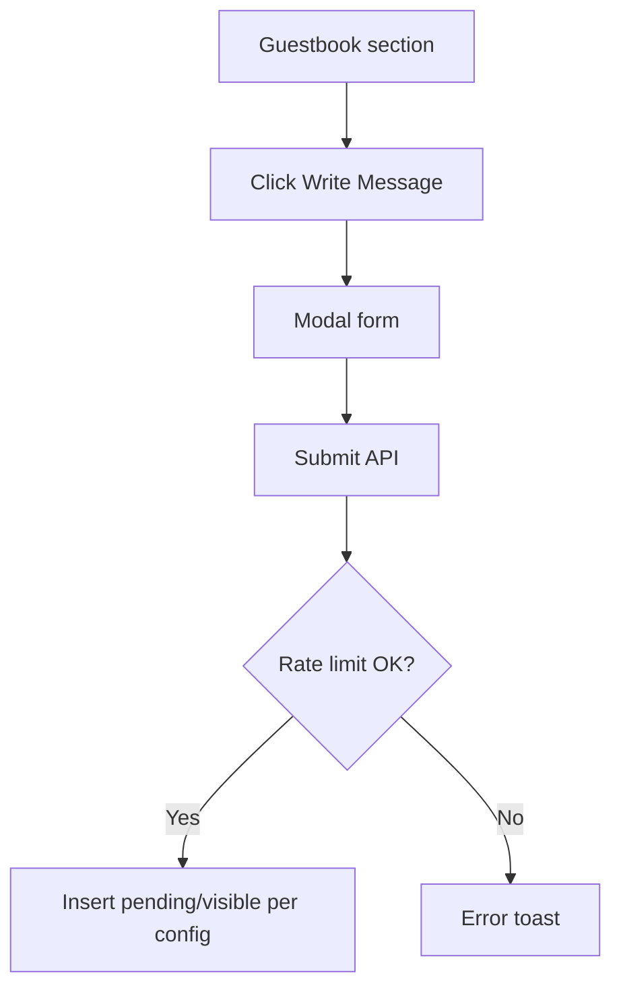
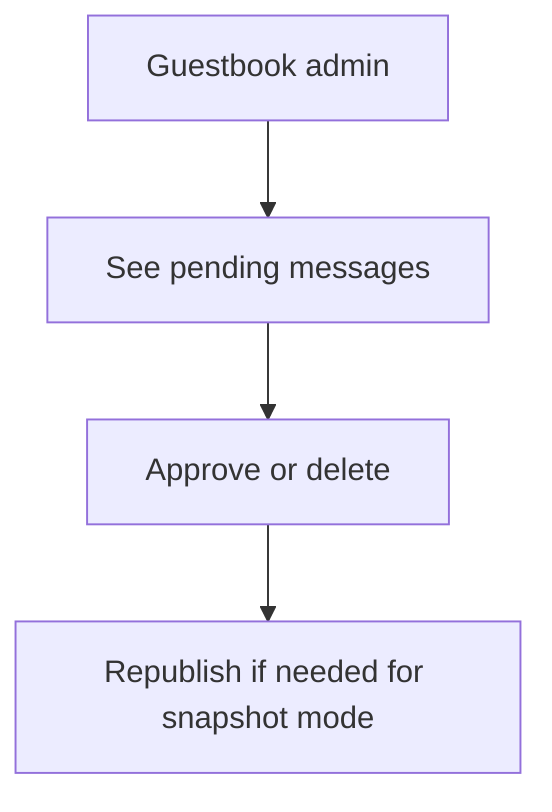

# 16. User Flow Document

## Flow 1 — Sign up & first publish (happy path)



**Goal:** < 30 minutes to live site.

## Flow 2 — Returning user edit



## Flow 3 — Template switch



## Flow 4 — Visitor



## Flow 5 — Guestbook submit (visitor)



## Flow 6 — Admin moderate guestbook



## Personas

See PRD §5 — primary: developer job seeker; secondary: freelancer/designer.

## Related

- [saas-wireframe-screen-list.md](./saas-wireframe-screen-list.md)
- [saas-admin-dashboard-ia.md](./saas-admin-dashboard-ia.md)

---

## Detail v0.3 — Critical Flows

### Critical Flow 1

```txt
Sign up → create site → choose template → fill profile → publish
```

### Critical Flow 2

```txt
Edit project → preview draft → publish → public updated
```

### Critical Flow 3

```txt
Visitor opens subdomain → site resolved → snapshot rendered
```

Any bug in these flows blocks beta.

---

## Appendix v0.3 — Detail Implementasi Tambahan

### Tujuan Operasional

Dokumen ini tidak hanya menjadi catatan konsep, tapi juga menjadi pegangan saat implementasi. Setiap keputusan di dalam dokumen harus bisa diturunkan menjadi task engineering, skenario QA, dan acceptance criteria.

### Prinsip Umum

- Gunakan pendekatan incremental, bukan rewrite total.
- Semua fitur yang menyentuh data user wajib scoped by `site_id`.
- Semua akses admin wajib melewati auth dan ownership guard.
- Public site hanya membaca data published, bukan draft.
- Jika ada konflik antara kecepatan rilis dan keamanan tenant, keamanan tenant harus diprioritaskan.
- Setiap perubahan besar harus bisa dirollback.

### Checklist Review

- [ ] Scope dokumen sudah jelas.
- [ ] Out of scope sudah ditulis agar tidak melebar.
- [ ] Dependency dengan dokumen lain sudah jelas.
- [ ] Ada acceptance criteria.
- [ ] Ada risiko dan mitigasi.
- [ ] Ada checklist QA atau validasi.
- [ ] Naming konsisten: `platform.com`, `site_id`, `organization_id`, `site_publish_snapshots`.
- [ ] Tidak ada keputusan yang bertentangan dengan PRD.

### Definition of Done

Dokumen dianggap siap dipakai jika engineer bisa membaca dokumen ini dan tahu:

1. Apa yang harus dibuat.
2. File/area mana yang kemungkinan berubah.
3. Data apa yang dibutuhkan.
4. Risiko apa yang harus dijaga.
5. Bagaimana cara mengetes hasilnya.
